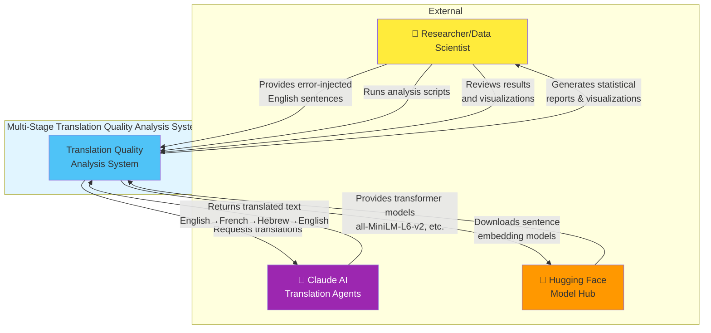
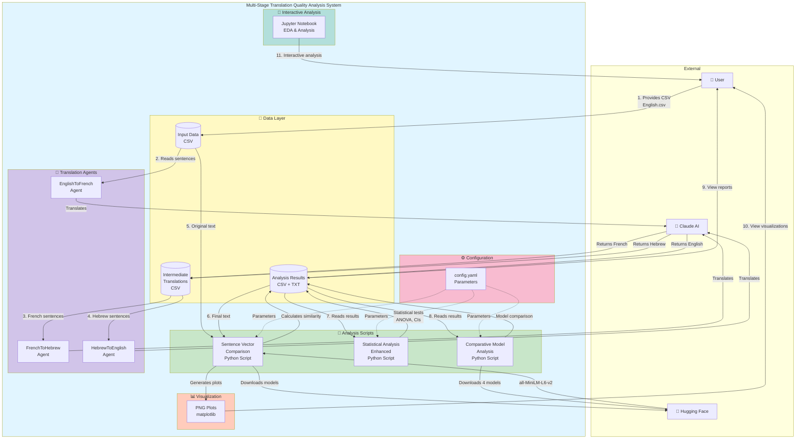
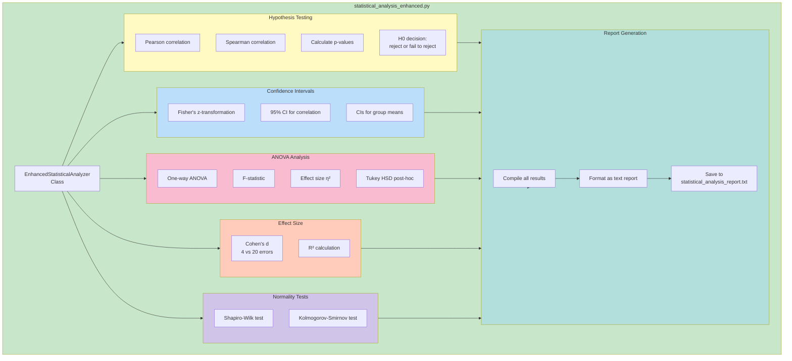
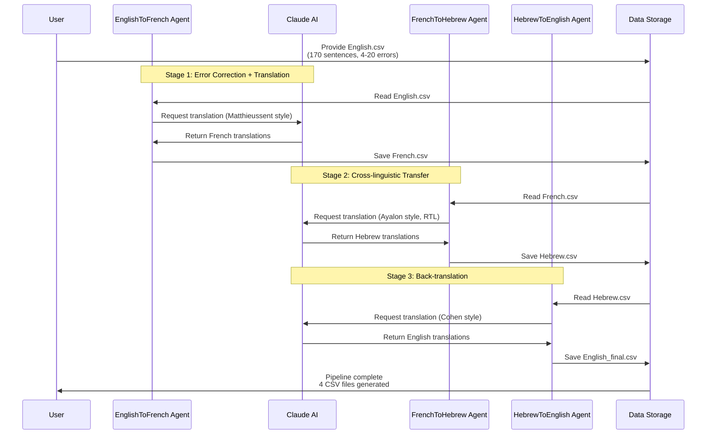
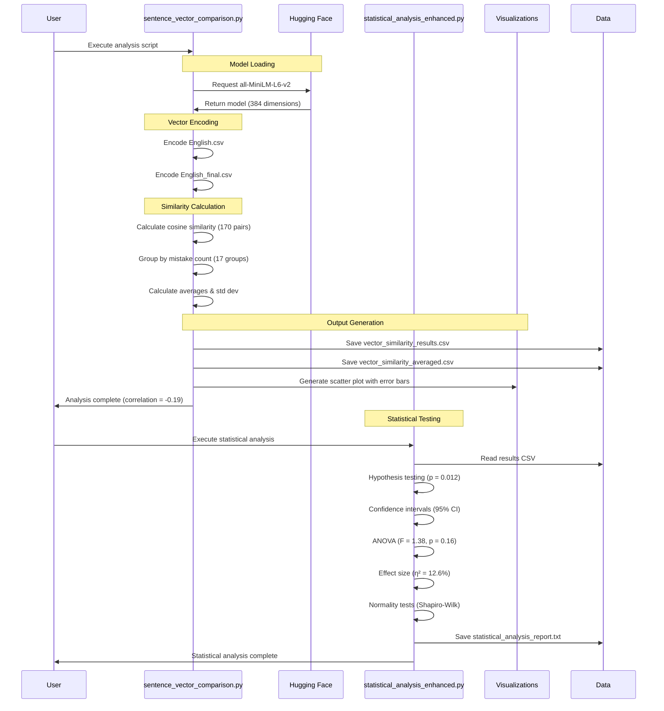
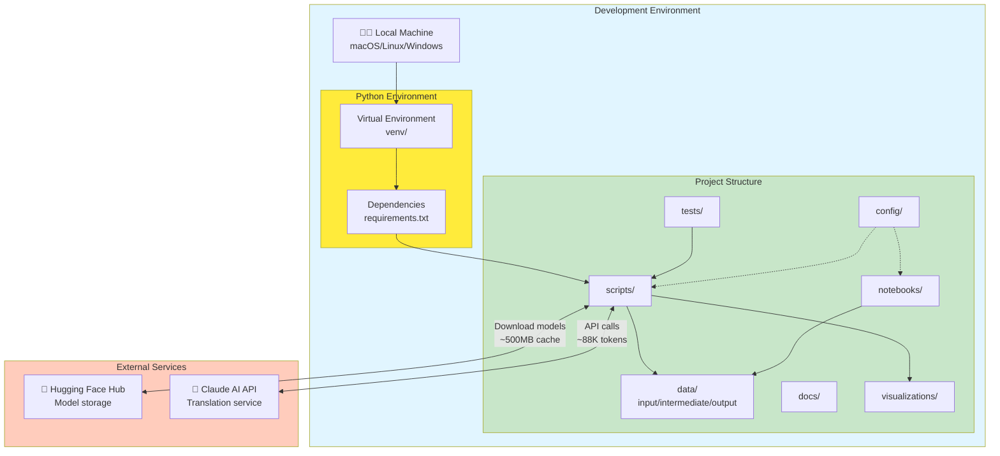

# Architecture Documentation
## Multi-Stage Translation Quality Analysis System

**Version:** 2.0
**Last Updated:** November 27, 2025

---

## C4 Model Architecture Diagrams

This document presents the system architecture using the C4 model (Context, Container, Component, Code).

---

## Level 1: System Context Diagram

The System Context diagram shows how the Multi-Stage Translation Quality Analysis System fits into the world around it.

**Key Interactions:**
- **User**: Provides input data (English sentences with errors) and executes analysis pipelines
- **Claude AI**: Performs multi-stage translations through specialized agents
- **Hugging Face**: Provides pre-trained sentence transformer models for semantic similarity
- **System**: Orchestrates translation, embedding, similarity calculation, and statistical analysis

---

## Level 2: Container Diagram

The Container diagram shows the high-level technical building blocks of the system.

**Container Descriptions:**

### 1. Data Layer (CSV Files)
- **Input**: `English.csv` - 170 sentences with 4-20 spelling errors
- **Intermediate**: `French.csv`, `Hebrew.csv` - Translation pipeline outputs
- **Output**: `English_final.csv`, results CSVs, statistical reports

### 2. Translation Agents (Claude AI Integration)
- **EnglishToFrench**: Corrects errors, translates to French (Matthieussent style)
- **FrenchToHebrew**: Translates to Hebrew with RTL formatting (Ayalon style)
- **HebrewToEnglish**: Translates back to English (Cohen style)

### 3. Analysis Scripts (Python)
- **sentence_vector_comparison.py**:
  - Loads sentence transformer models from Hugging Face
  - Encodes sentences into 384-dimensional vectors
  - Calculates cosine similarity
  - Groups by error count and computes averages

- **statistical_analysis_enhanced.py**:
  - Hypothesis testing (H0/H1, p-values)
  - 95% confidence intervals
  - ANOVA with Tukey HSD post-hoc
  - Effect size calculations (η², Cohen's d)
  - Normality tests

- **comparative_model_analysis.py**:
  - Tests 4 different embedding models
  - Baseline identity comparison
  - Model performance metrics

### 4. Visualization (matplotlib)
- Scatter plots with error bars
- Trend lines and regression
- Model comparison charts
- 300 DPI publication-quality images

### 5. Interactive Analysis (Jupyter)
- Exploratory Data Analysis (EDA)
- 10+ interactive visualizations
- Step-by-step statistical walkthrough

### 6. Configuration (YAML)
- Centralized parameter management
- Model selections
- Statistical parameters (α, confidence levels)
- File paths

---

## Level 3: Component Diagram (Analysis Scripts)

### Sentence Vector Comparison Components

```mermaid
graph TB
    subgraph SentVecScript[sentence_vector_comparison.py]
        Main[main function]

        subgraph DataLoad[Data Loading]
            LoadCSV1[Load English.csv]
            LoadCSV2[Load English_final.csv]
            SortData[Sort by Index]
            CleanData[Remove empty rows]
        end

        subgraph Encoding[Vector Encoding]
            LoadModel[Load SentenceTransformer<br/>all-MiniLM-L6-v2]
            Encode1[Encode original sentences]
            Encode2[Encode final sentences]
        end

        subgraph Similarity[Similarity Calculation]
            CalcSim[Calculate cosine<br/>similarity pairwise]
            GroupMistakes[Group by mistake count]
            CalcAvg[Calculate mean & std<br/>per group]
        end

        subgraph Visualization[Visualization]
            CreatePlot[Create scatter plot]
            AddErrorBars[Add error bars]
            AddTrend[Add trend line]
            AddStats[Add statistics box]
            SavePNG[Save PNG at 300 DPI]
        end

        subgraph Output[Output Generation]
            SaveResults[Save individual results<br/>vector_similarity_results.csv]
            SaveAveraged[Save averaged results<br/>vector_similarity_averaged.csv]
        end
    end

    Main --> LoadCSV1
    Main --> LoadCSV2
    LoadCSV1 --> SortData
    LoadCSV2 --> SortData
    SortData --> CleanData

    CleanData --> LoadModel
    LoadModel --> Encode1
    LoadModel --> Encode2

    Encode1 --> CalcSim
    Encode2 --> CalcSim
    CalcSim --> GroupMistakes
    GroupMistakes --> CalcAvg

    CalcAvg --> CreatePlot
    CreatePlot --> AddErrorBars
    AddErrorBars --> AddTrend
    AddTrend --> AddStats
    AddStats --> SavePNG

    CalcSim --> SaveResults
    CalcAvg --> SaveAveraged

    style SentVecScript fill:#c8e6c9
    style DataLoad fill:#fff9c4
    style Encoding fill:#bbdefb
    style Similarity fill:#f8bbd0
    style Visualization fill:#ffccbc
    style Output fill:#d1c4e9
```

### Statistical Analysis Components

---

## Data Flow Architecture

### Translation Pipeline Flow

### Analysis Pipeline Flow

---

## Technology Stack

```mermaid
graph TB
    subgraph Languages[Programming Languages]
        Python[Python 3.9+]
    end

    subgraph ML[Machine Learning & NLP]
        SentenceTransformers[sentence-transformers<br/>Sentence embeddings]
        SkLearn[scikit-learn<br/>Cosine similarity]
        HuggingFace[Hugging Face Transformers<br/>Model hub]
    end

    subgraph Stats[Statistical Libraries]
        SciPy[scipy<br/>Statistical tests]
        StatsModels[statsmodels<br/>ANOVA, Tukey HSD]
    end

    subgraph DataViz[Data & Visualization]
        Pandas[pandas<br/>Data manipulation]
        NumPy[numpy<br/>Numerical computing]
        Matplotlib[matplotlib<br/>Plotting]
        Seaborn[seaborn<br/>Statistical plots]
        Jupyter[Jupyter<br/>Interactive notebooks]
    end

    subgraph AIAgents[AI Integration]
        ClaudeAPI[Claude AI<br/>Translation agents]
    end

    subgraph Config[Configuration]
        YAML[PyYAML<br/>Config management]
    end

    subgraph Testing[Testing & QA]
        Pytest[pytest<br/>Test framework]
        PytestCov[pytest-cov<br/>Coverage reporting]
    end

    Python --> SentenceTransformers
    Python --> SkLearn
    Python --> SciPy
    Python --> StatsModels
    Python --> Pandas
    Python --> NumPy
    Python --> Matplotlib
    Python --> Seaborn
    Python --> Jupyter
    Python --> ClaudeAPI
    Python --> YAML
    Python --> Pytest

    style Languages fill:#4fc3f7
    style ML fill:#c8e6c9
    style Stats fill:#fff9c4
    style DataViz fill:#ffccbc
    style AIAgents fill:#d1c4e9
    style Config fill:#f8bbd0
    style Testing fill:#b2dfdb
```

---

## Deployment View

---

## Key Architecture Decisions

### 1. Multi-Agent Translation Pipeline
**Decision**: Use three separate specialized translation agents instead of one general-purpose agent
**Rationale**:
- Each agent applies specific translation style (Matthieussent, Ayalon, Cohen)
- Better control over error correction timing (Stage 1 only)
- Cultural mediation at each stage
- Clear separation of concerns

### 2. Sentence Transformers for Embeddings
**Decision**: Use `sentence-transformers/all-MiniLM-L6-v2` as primary model
**Rationale**:
- 384-dimensional embeddings (good balance size/performance)
- Fast inference (~100 sentences/second)
- Pre-trained on semantic similarity tasks
- Small model size (~90MB)

### 3. Averaged Group Analysis
**Decision**: Group 10 sentences per error count and report averages
**Rationale**:
- Reduces noise from individual outliers
- Stratified sampling ensures balanced representation
- Statistical power with n=10 per group
- Clearer trend visualization

### 4. Comprehensive Statistical Testing
**Decision**: Include hypothesis testing, CIs, ANOVA, effect sizes
**Rationale**:
- Academic rigor for research publication
- Multiple validation approaches
- Effect size provides practical significance
- Meets university grading criteria (95+)

### 5. CSV-Based Data Pipeline
**Decision**: Use CSV files for all data storage
**Rationale**:
- Human-readable and editable
- Excel compatibility for stakeholders
- Simple backup and version control
- No database dependencies

### 6. Folder-Based Organization
**Decision**: Organize into `config/`, `data/`, `scripts/`, `notebooks/`, `docs/`, `tests/`, `visualizations/`
**Rationale**:
- Industry best practice
- Clear separation of concerns
- Scalable for future additions
- Easy navigation for new contributors

---

## Performance Characteristics

### Translation Pipeline
- **Throughput**: 170 sentences in ~20 minutes
- **Token Usage**: ~88,740 tokens ($0.40 with Sonnet)
- **Bottleneck**: API calls to Claude AI

### Analysis Pipeline
- **Sentence Encoding**: ~5 seconds for 340 sentences
- **Similarity Calculation**: <1 second for 170 pairs
- **Statistical Analysis**: ~2 seconds
- **Bottleneck**: Model loading from disk (first time: ~3 seconds)

### Storage Requirements
- **Models**: ~500MB (cached from Hugging Face)
- **Data**: ~2MB (CSV files)
- **Outputs**: ~5MB (plots, reports)
- **Total**: ~507MB

---

## Security Considerations

1. **API Keys**: Not hardcoded, managed externally
2. **Secrets**: `.gitignore` excludes `.env`, `credentials.json`
3. **Data Privacy**: All data processed locally (except Claude API calls)
4. **Model Provenance**: All models from verified Hugging Face sources

---

## Scalability Considerations

### Current Scale
- 170 sentences
- 17 error count groups
- 4 translation stages

### Scaling Options
1. **Horizontal**: Batch processing with multiprocessing
2. **Data**: Can handle 10K+ sentences with same architecture
3. **Languages**: Modular design supports adding new language pairs
4. **Models**: Comparative analysis framework supports N models

---

**Document Status**: ✅ Complete
**Last Review**: November 27, 2025
**Next Review**: Quarterly or upon major architecture changes
