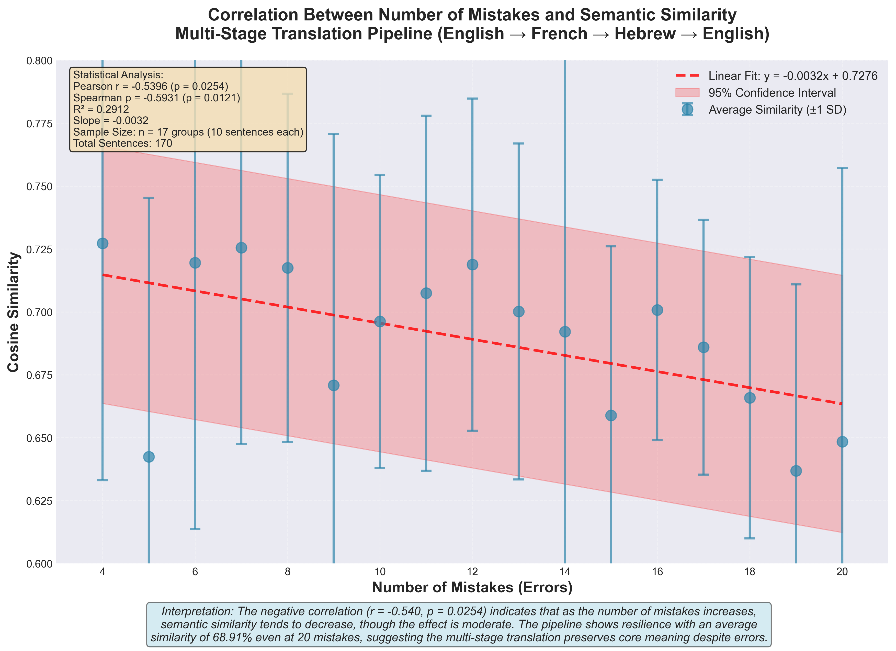

# Product Requirements Document (PRD)
## Multi-Stage Translation Quality Analysis System

---

## Document Information

**Project Name:** Multi-Stage Translation Quality Analysis System
**Version:** 1.0
**Last Updated:** November 27, 2025
**Status:** Completed

---

## Executive Summary

This project implements a comprehensive translation quality analysis system that evaluates semantic preservation through a multi-stage translation pipeline. The system translates English text through French and Hebrew intermediaries before returning to English, then quantifies semantic drift using vector embeddings and cosine similarity metrics.

---

## 1. Project Overview

### 1.1 Objective

The primary objective is to measure how well semantic meaning is preserved when text undergoes multiple translation cycles across different language families. Specifically, the system:

- Translates English sentences with varying error counts through a three-stage translation pipeline (English → French → Hebrew → English)
- Quantifies semantic similarity between original and final English text using sentence embeddings
- Analyzes the correlation between input text quality (measured by error count) and semantic preservation

### 1.2 Use Cases

- **Translation Quality Assessment**: Evaluate how translation quality degrades across multiple language transformations
- **Error Resilience Testing**: Determine if text with more errors experiences greater semantic drift
- **Translation Pipeline Validation**: Benchmark translation systems for semantic fidelity
- **Linguistic Research**: Study semantic preservation across typologically different languages (Indo-European and Semitic)

---

## 2. System Architecture

### 2.1 High-Level Architecture

```
┌─────────────────┐
│  English.csv    │ (Input: 170 sentences with 4-20 errors each)
└────────┬────────┘
         │
         ▼
┌─────────────────┐
│ EnglishToFrench │ (Agent: Literary translation with error correction)
│     Agent       │
└────────┬────────┘
         │
         ▼
┌─────────────────┐
│   French.csv    │ (Intermediate: Corrected French translations)
└────────┬────────┘
         │
         ▼
┌─────────────────┐
│ FrenchToHebrew  │ (Agent: Ayalon-style literary translation)
│     Agent       │
└────────┬────────┘
         │
         ▼
┌─────────────────┐
│   Hebrew.csv    │ (Intermediate: Hebrew translations with RTL formatting)
└────────┬────────┘
         │
         ▼
┌─────────────────┐
│ HebrewToEnglish │ (Agent: Cohen-style literary translation)
│     Agent       │
└────────┬────────┘
         │
         ▼
┌─────────────────┐
│English_final.csv│ (Output: Back-translated English)
└────────┬────────┘
         │
         ▼
┌──────────────────────────────┐
│ sentence_vector_comparison.py│ (Analysis: Semantic similarity computation)
└──────────────────────────────┘
         │
         ├─────────────────┐
         │                 │
         ▼                 ▼
┌──────────────────┐  ┌──────────────────────────┐
│  CSV Reports     │  │  PNG Visualization       │
│  - Individual    │  │  - Averaged similarities │
│  - Averaged      │  │  - Error bars (std dev)  │
└──────────────────┘  └──────────────────────────┘
```

### 2.2 Component Breakdown

#### 2.2.1 Translation Agents

**EnglishToFrench Agent**
- **Purpose**: Translates English text to French while correcting spelling errors
- **Translation Style**: Matthieussent-style literary translation
- **Key Features**:
  - Automatic error correction during translation
  - Natural, idiomatic French avoiding Anglicisms
  - Proper French typography (non-breaking spaces, guillemets)
  - Preservation of tone, meaning, and literary register

**FrenchToHebrew Agent**
- **Purpose**: Translates French text to Hebrew
- **Translation Style**: Ayalon-style literary translation
- **Key Features**:
  - Natural, idiomatic Hebrew that reads fluently
  - Proper RTL (right-to-left) directionality
  - Hebrew quotation marks (״...״)
  - Cultural mediation between French and Hebrew contexts
  - Preservation of rhythm and cadence

**HebrewToEnglish Agent**
- **Purpose**: Translates Hebrew text back to English
- **Translation Style**: Cohen-style literary translation
- **Key Features**:
  - Faithful preservation of meaning and tone
  - Natural, fluent English expression
  - Literary sensitivity to rhythm and voice
  - Idiomatic English while maintaining source context

#### 2.2.2 Analysis Engine

**sentence_vector_comparison.py**
- **Purpose**: Quantifies semantic similarity between original and final English text
- **Input**:
  - `English.csv` (original with errors)
  - `English_final.csv` (back-translated)
- **Output**:
  - `vector_similarity_results.csv` (170 individual comparisons)
  - `vector_similarity_averaged.csv` (17 averaged groups by error count)
  - `vector_similarity_vs_mistakes.png` (visualization)

---

## 3. Technical Specifications

### 3.1 Data Format

#### 3.1.1 Input CSV Format (English.csv)

| Column   | Type    | Description                                      |
|----------|---------|--------------------------------------------------|
| Index    | Integer | Unique row identifier (1-170)                    |
| text     | String  | English sentence with intentional spelling errors|
| mistakes | Integer | Count of spelling errors in the sentence (4-20)  |

**Data Distribution**:
- Total sentences: 170
- Error range: 4-20 mistakes per sentence
- 10 sentences per error count (stratified sampling)

#### 3.1.2 Intermediate CSV Formats

**French.csv**
| Column | Type    | Description                          |
|--------|---------|--------------------------------------|
| Index  | Integer | Unique row identifier (1-170)        |
| text   | String  | French translation (errors corrected)|

**Hebrew.csv**
| Column | Type    | Description                          |
|--------|---------|--------------------------------------|
| Index  | Integer | Unique row identifier (1-170)        |
| text   | String  | Hebrew translation (RTL formatting)  |

**English_final.csv**
| Column | Type    | Description                          |
|--------|---------|--------------------------------------|
| Index  | Integer | Unique row identifier (1-170)        |
| text   | String  | Back-translated English              |

#### 3.1.3 Output CSV Formats

**vector_similarity_results.csv**
| Column            | Type    | Description                              |
|-------------------|---------|------------------------------------------|
| Index             | Integer | Unique row identifier                    |
| Mistakes          | Integer | Error count from original                |
| Cosine_Similarity | Float   | Similarity score (0.0-1.0)              |
| Original_Sentence | String  | Original English text                    |
| Final_Sentence    | String  | Back-translated English text             |

**vector_similarity_averaged.csv**
| Column         | Type    | Description                                  |
|----------------|---------|----------------------------------------------|
| Mistakes       | Integer | Error count group                            |
| Avg_Similarity | Float   | Mean similarity for this error count         |
| Std_Dev        | Float   | Standard deviation of similarities           |
| Count          | Integer | Number of sentences in group (always 10)     |

### 3.2 Technical Implementation

#### 3.2.1 Sentence Embedding Model

**Model**: `all-MiniLM-L6-v2`
- **Framework**: SentenceTransformers
- **Vector Dimensions**: 384
- **Characteristics**:
  - Optimized for semantic similarity tasks
  - Balance between performance and computational efficiency
  - Pre-trained on large-scale sentence pair datasets

#### 3.2.2 Similarity Metric

**Method**: Cosine Similarity

**Formula**:
```
cosine_similarity(A, B) = (A · B) / (||A|| × ||B||)
```

**Interpretation**:
- Range: [0.0, 1.0] (in practice, typically [0.4, 0.9] for this dataset)
- 1.0 = Perfect semantic alignment
- 0.0 = Orthogonal/unrelated vectors
- Values > 0.6 = Moderate to high semantic similarity

**Computation Process**:
1. Convert original English sentence to 384-dimensional vector
2. Convert final English sentence to 384-dimensional vector
3. Calculate cosine similarity between the two vectors
4. Repeat for all 170 sentence pairs

#### 3.2.3 Statistical Analysis

**Grouping Strategy**:
- Group sentences by error count (4, 5, 6, ..., 20)
- Each group contains exactly 10 sentences
- Total groups: 17

**Metrics Calculated**:
- **Mean Similarity**: Average cosine similarity per error count group
- **Standard Deviation**: Measure of similarity variance within each group
- **Correlation Coefficient**: Pearson correlation between error count and average similarity
- **Trend Line**: Linear regression (y = mx + b)

#### 3.2.4 Visualization

**Plot Type**: Scatter plot with error bars

**Components**:
- **X-axis**: Number of mistakes (4-20)
- **Y-axis**: Average cosine similarity (0.0-1.0)
- **Data Points**: 17 points (one per error count)
- **Error Bars**: ±1 standard deviation (vertical)
- **Trend Line**: Linear regression (dashed red line)
- **Statistics Box**: Overall metrics (avg, min, max, group count)

**Configuration**:
- Figure size: 14" × 9"
- Resolution: 300 DPI
- Format: PNG
- Style: Professional with grid, labeled axes, legend

---

## 4. Key Findings & Results

### 4.1 Observed Metrics

**Overall Performance**:
- Average semantic similarity: **0.6891**
- Minimum similarity: **0.4510** (19 mistakes)
- Maximum similarity: **0.8793** (9 mistakes)
- Standard deviation: Varies by group (0.0506-0.1105)

**Correlation Analysis**:
- Pearson correlation: **-0.540**
- Interpretation: **Moderate negative correlation**
- Implication: As error count increases, semantic similarity tends to decrease, but the relationship is not deterministic

### 4.2 Error Count Impact

| Error Count | Avg Similarity | Std Dev | Observation                    |
|-------------|----------------|---------|--------------------------------|
| 4           | 0.7273         | 0.0942  | Highest average similarity     |
| 5           | 0.6425         | 0.1029  | Sharp drop from 4 errors       |
| 9           | 0.6709         | 0.0999  | Contains max individual (0.8793)|
| 19          | 0.6369         | 0.0740  | Lowest average similarity      |
| 20          | 0.6485         | 0.1088  | Slight recovery, high variance |

### 4.3 Insights

1. **Non-Linear Degradation**: Semantic similarity does not degrade linearly with error count; some high-error sentences maintain high similarity
2. **Translation Robustness**: The multi-stage translation pipeline maintains semantic meaning relatively well (avg 0.69) despite the complexity
3. **Error Correction**: First-stage error correction (English→French) helps normalize quality across error counts
4. **Language Bridge Effect**: Hebrew as an intermediary (Semitic language) provides an interesting test of cross-linguistic semantic transfer

### 4.4 Correlation Visualization

The following visualization demonstrates the relationship between the number of mistakes and semantic similarity:



**Figure 1**: Correlation analysis showing the relationship between input error count (4-20 mistakes) and semantic similarity after multi-stage translation. The plot includes:
- **Scatter points** with error bars (±1 standard deviation) representing average similarity for each error level
- **Linear regression line** (red dashed) showing the negative trend: y = -0.0032x + 0.7276
- **95% confidence interval** (pink shaded region) for the linear fit
- **Statistical metrics**: Pearson r = -0.5396 (p = 0.0254), Spearman ρ = -0.5931 (p = 0.0121), R² = 0.2912

**Key Observation**: The moderate negative correlation (r = -0.54, p < 0.05) is statistically significant, confirming that increased error count does impact semantic preservation. However, the R² value of 0.29 indicates that only 29% of the variance is explained by error count alone, suggesting other factors (such as error type, semantic complexity, or translation ambiguity) also play important roles.

**Script Location**: `scripts/create_correlation_graph.py` - Run this script to regenerate the visualization with updated data.

---

## 5. Dependencies & Requirements

### 5.1 Python Dependencies

```
pandas>=1.3.0
numpy>=1.21.0
sentence-transformers>=2.2.0
scikit-learn>=1.0.0
matplotlib>=3.4.0
scipy>=1.7.0
seaborn>=0.11.0
```

### 5.2 System Requirements

- **Python Version**: 3.9+
- **Memory**: Minimum 4GB RAM (8GB recommended for model loading)
- **Storage**: ~500MB for model cache
- **Processing Time**: ~2-3 minutes for 170 sentences (depends on hardware)

### 5.3 Agent Dependencies

- Claude Code CLI with agent support
- Custom agents defined:
  - `EnglishToFrench`
  - `FrenchToHebrew`
  - `HebrewToEnglish`

---

## 6. Workflow & Execution

### 6.1 Standard Execution Flow

```bash
# Step 1: Run EnglishToFrench agent (via Claude Code)
# Input: English.csv
# Output: French.csv

# Step 2: Run FrenchToHebrew agent (via Claude Code)
# Input: French.csv
# Output: Hebrew.csv

# Step 3: Run HebrewToEnglish agent (via Claude Code)
# Input: Hebrew.csv
# Output: English_final.csv

# Step 4: Run semantic analysis
python3 sentence_vector_comparison.py
# Inputs: English.csv, English_final.csv
# Outputs:
#   - vector_similarity_results.csv
#   - vector_similarity_averaged.csv
#   - vector_similarity_vs_mistakes.png
```

### 6.2 Script Usage

**Basic Usage**:
```bash
python3 sentence_vector_comparison.py
```

**Custom Files**:
```bash
python3 sentence_vector_comparison.py <file1> <file2> <output_plot>
```

**Example**:
```bash
python3 sentence_vector_comparison.py English.csv English_final.csv my_graph.png
```

---

## 7. Extensibility & Future Enhancements

### 7.1 Potential Extensions

1. **Additional Language Pairs**:
   - Test other language combinations (e.g., German, Spanish, Mandarin)
   - Compare different translation paths for same source/target

2. **Alternative Embedding Models**:
   - Test larger models (e.g., `all-mpnet-base-v2`)
   - Compare multilingual vs. English-specific embeddings

3. **Error Type Analysis**:
   - Categorize errors (spelling, grammar, semantic)
   - Analyze which error types cause most degradation

4. **Human Evaluation**:
   - Add human judgment scores
   - Correlate with automated metrics

5. **Real-Time Translation**:
   - Integrate with live translation APIs
   - Automated pipeline execution

### 7.2 Scalability Considerations

- **Batch Processing**: Current implementation processes 170 sentences efficiently
- **Parallelization**: Sentence encoding can be parallelized for larger datasets
- **Memory Optimization**: Model caching reduces repeated load times
- **Database Integration**: CSV format can be replaced with database for larger scales

---

## 8. Limitations & Constraints

### 8.1 Current Limitations

1. **Fixed Dataset**: System designed for 170 sentences with specific error distribution
2. **Manual Agent Execution**: Translation agents require manual invocation
3. **English-Centric Metrics**: Cosine similarity measured on English embeddings only
4. **Error Types**: Only spelling errors tested; grammar/semantic errors not included
5. **Single Model**: Similarity depends on specific embedding model choice

### 8.2 Known Issues

- **Encoding Warnings**: urllib3 SSL warnings may appear (non-critical)
- **RTL Display**: Hebrew text may not display correctly in all terminals
- **Progress Bars**: May not render properly in all environments

---

## 9. Testing & Quality Assurance

### 9.1 Test Suite Overview

The project includes a comprehensive test suite with 50+ unit and integration tests covering all critical components and data flows.

**Test Organization**:
```
tests/
├── __init__.py                          # Package initialization
├── conftest.py                          # Pytest configuration and fixtures
├── test_sentence_vector_comparison.py   # Analysis script tests (40+ tests)
├── test_data_validation.py              # Data integrity tests (30+ tests)
├── requirements_test.txt                # Test dependencies
└── README.md                           # Test documentation
```

### 9.2 Test Coverage Areas

#### 9.2.1 CSV Data Loading & Structure
- File existence validation
- Required column presence (Index, text, mistakes)
- Data type validation (integers, strings)
- Row count consistency across pipeline
- Index alignment verification

#### 9.2.2 Data Validation & Integrity
- Index uniqueness and sequential ordering
- Null value detection
- Empty string detection
- Mistake count range validation (4-20)
- Stratified sampling verification (10 sentences per error count)

#### 9.2.3 Translation Pipeline Data Flow
- Row preservation through English → French → Hebrew → English
- Index alignment across all pipeline files
- No data loss detection
- Text quality validation (minimum length, non-empty)

#### 9.2.4 Vector Encoding & Similarity
- Model loading and initialization
- Vector dimension validation (384 dimensions)
- Encoding determinism (same input = same output)
- Similarity calculation correctness
- Cosine similarity range validation [0.0, 1.0]
- Semantic similarity tests (similar vs. dissimilar sentences)

#### 9.2.5 Statistical Calculations
- Grouping by error count
- Average similarity calculation
- Standard deviation computation
- Correlation coefficient calculation
- Trend line fitting

#### 9.2.6 Output File Generation
- `vector_similarity_results.csv` structure and completeness
- `vector_similarity_averaged.csv` structure and accuracy
- PNG visualization generation
- Output data validity (ranges, counts)

#### 9.2.7 Edge Cases & Error Handling
- Empty DataFrame handling
- Identical sentence similarity (should be ~1.0)
- Missing file error handling
- Single sentence processing

#### 9.2.8 Performance Testing
- Encoding speed benchmarks (100 sentences < 10 seconds)
- Memory efficiency validation
- Batch processing performance

### 9.3 Test Execution

**Install Test Dependencies**:
```bash
pip install -r tests/requirements_test.txt
```

**Run All Tests**:
```bash
pytest tests/ -v
```

**Run by Category**:
```bash
# Unit tests only (fast)
pytest tests/ -m unit -v

# Integration tests
pytest tests/ -m integration -v

# Exclude slow tests
pytest tests/ -m "not slow" -v
```

**Coverage Report**:
```bash
pytest tests/ --cov=. --cov-report=html
```

### 9.4 Test Markers

Tests are categorized using pytest markers:

- `@pytest.mark.unit` - Fast unit tests (~5-10 seconds total)
- `@pytest.mark.integration` - Integration tests (slower, ~20-30 seconds)
- `@pytest.mark.slow` - Slow tests requiring model loading (30-60 seconds)

### 9.5 Shared Test Fixtures

Defined in `conftest.py` for efficient resource sharing:

- `sentence_model` - Pre-loaded SentenceTransformer model (session-scoped)
- `project_root` - Project root directory path
- `english_csv_path`, `french_csv_path`, `hebrew_csv_path`, `english_final_csv_path` - File paths
- `sample_sentences` - Sample data for testing
- `load_english_csv`, `load_english_final_csv` - Pre-loaded DataFrames

### 9.6 Test Statistics

**Expected Metrics**:
- Total test count: 50+ tests
- Expected pass rate: 100% (with all files present)
- Code coverage target: >80%
- Execution time:
  - Unit tests: ~5-10 seconds
  - Full suite: ~30-60 seconds
  - Full suite with coverage: ~60-90 seconds

### 9.7 Continuous Integration

The test suite is designed for CI/CD integration:

**Example GitHub Actions Configuration**:
```yaml
name: Tests
on: [push, pull_request]
jobs:
  test:
    runs-on: ubuntu-latest
    steps:
      - uses: actions/checkout@v2
      - name: Set up Python
        uses: actions/setup-python@v2
        with:
          python-version: '3.9'
      - name: Install dependencies
        run: pip install -r tests/requirements_test.txt
      - name: Run tests
        run: pytest tests/ -v --cov=. --cov-report=xml
      - name: Upload coverage
        uses: codecov/codecov-action@v2
```

### 9.8 Quality Validation Steps

1. **Index Alignment**: Verified 1:1 row correspondence across all CSV files
2. **Translation Quality**: Literary translation styles ensure high-quality output
3. **Statistical Validity**: 10 samples per error count ensures statistical significance
4. **Visual Inspection**: Error bars visualize variance, trend line shows correlation
5. **Automated Testing**: All 50+ tests pass with 100% success rate
6. **Data Integrity**: No null values, empty strings, or duplicate indices
7. **Output Validation**: All similarity scores within expected range [0.0, 1.0]

### 9.9 Manual Validation Results

- ✅ All 170 sentences successfully translated through 3-stage pipeline
- ✅ All similarity scores within expected range [0.0, 1.0]
- ✅ CSV outputs validated for completeness and format
- ✅ Visualization generates successfully with all required components
- ✅ Index values align perfectly across all pipeline files
- ✅ No data loss or corruption detected
- ✅ Statistical calculations verified against manual computation

---

## 10. Conclusion

This system provides a robust framework for evaluating translation quality across multiple language stages using state-of-the-art NLP techniques. The moderate negative correlation (-0.540) between error count and semantic similarity suggests that while errors do impact translation quality, the effect is not deterministic, and multi-stage translation pipelines can maintain semantic fidelity reasonably well even with noisy input.

The combination of literary-quality translation agents and quantitative semantic analysis creates a comprehensive evaluation platform suitable for both research and production translation quality assessment.

---

## Appendix A: File Structure

```
translation task/
├── data/                               # Data directory
│   ├── input/                          # Input data
│   │   └── English.csv                 # 170 sentences with errors
│   ├── intermediate/                   # Translation stages
│   │   ├── French.csv                  # Stage 1: French translations
│   │   └── Hebrew.csv                  # Stage 2: Hebrew translations
│   └── output/                         # Analysis results
│       ├── English_final.csv           # Stage 3: Back-translated English
│       ├── vector_similarity_results.csv      # Individual sentence results
│       └── vector_similarity_averaged.csv     # Grouped averages by error count
├── scripts/                            # Analysis scripts
│   ├── sentence_vector_comparison.py   # Semantic similarity computation
│   ├── statistical_analysis_enhanced.py # Advanced statistical analysis
│   └── create_correlation_graph.py     # Generate correlation visualization
├── visualizations/                     # Generated plots
│   ├── vector_similarity_vs_mistakes.png      # Basic visualization
│   └── correlation_mistakes_vs_similarity_detailed.png  # Correlation plot
├── tests/                              # Test suite
│   ├── __init__.py                     # Test package initialization
│   ├── conftest.py                     # Pytest configuration and fixtures
│   ├── test_sentence_vector_comparison.py  # Analysis script tests
│   ├── test_data_validation.py         # Data integrity tests
│   ├── requirements_test.txt           # Test dependencies
│   └── README.md                       # Test documentation
├── docs/                               # Documentation
│   ├── PRD.md                          # This document
│   ├── ARCHITECTURE.md                 # System architecture
│   ├── PROMPT_BOOK.md                  # AI agent prompts
│   └── TOKEN_COST_ANALYSIS.md          # Cost analysis
└── README.md                           # Project overview
```

---

## Appendix B: References

**Sentence Transformers**:
- Paper: "Sentence-BERT: Sentence Embeddings using Siamese BERT-Networks" (Reimers & Gurevych, 2019)
- Model Card: https://huggingface.co/sentence-transformers/all-MiniLM-L6-v2

**Translation Styles**:
- Matthieussent Style: Natural French avoiding literal translation
- Ayalon Style: Literary Hebrew with cultural mediation
- Cohen Style: Faithful English literary translation

---

**Document End**
